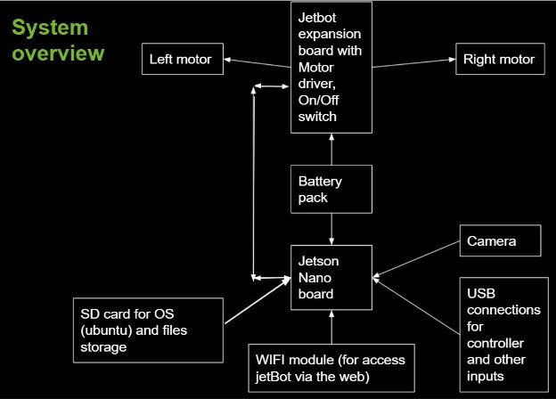

**Final report for Jetbot AI kit based on NVIDIA Jetson Nano**
 
 **Wen Zhe Xian**
 
 Software installation is in installation.md

**1. Introduction:** Build a waveshare jetBot AI kit based on Nvidia Jetson Nano 4GB.

**a. Goal of this project:**

1. Collision avoidance

2. Line following
3. Line following + stop when obstruct present, go when obstruct remove
4. Object following + stop when close to the object

**b. Lever of autonomy:**

1. Should be level 3 since it only has one camera in the front to detect the Jetbot’s surroundings and it can make informed decisions for itself, such as turning, starting and stopping. But it still requires human supervision. The person must remain alert and ready to take control if the system is unable to execute the task.

**c. Description:**

1. System overview

**2.Relate work:**

1. The flying drone track and land on a moving platform inspire me about this project. Waveshare wiki and nvidia jetbot GitHub wiki helps me to finish this project.

**3.Team Organization**

1. Solo

**4.Software and Developing tools**

*a. Software + Developing tools*

1. Python 3 Jupyter notebook

3. Opencv
4. Codes are all base on Github NVIDIA-AI-IOT / jetbot wiki, with modifications to fit my waveshare third party jetbot, because the scale of the speed is different than the first party kit
5. Jetson OS named JetPack 4.3 based on Ubuntu from NVIDIA
6. TensorRT, is a library developed by NVIDIA for faster inference on NVIDIA graphics processing units (GPUs)
7. PyTorch, is open source machine learning library based on the Torch library, used for applications such as computer vision and natural language processing
8. COCO dataset for objects tracking neural network training
9. 420 pictures taken by myself for line following neural network training
10. 120 pictures taken by myself for collision avoidance neural network training

*b. Laptop setup*

1. Windows 10
2. Python 3 Jupyter notebook
3. Opencv

*c. Hardware need:*

a. Waveshare Jetbot AI kit contains major components as follow

   1. Two motors for controlling the left and right wheel independently
   
   2. Camera module
   3. Wifi module for web based access to the jetbot
   4. SD memory card for the jetson operation system named jetPack (based on ubuntu)
   5. NVIDIA Jetson Nano 4GB (for better performance)
   6. 3 packs of 14867 battery
   7. 12V power power supply for battery charging
   8. 5V/4A 20W power supply for powering jetson nano directly

**5. Simulator:**
1. None

**6. List of milestones:**

a. Finish assembling the JetBot kit, install the essential software into the Jetson and test the basic function before 18JUL2021.

b. Build a racing track that suitable for jetbot used, since there has viewing field limitation on the camera module

c. Perform collision avoidance successfully and record demo videos

d. Perform line following successfully and record demo videos
   1. Test line following feature on the track from milestone “ii”
   2. Take more (end up total 420) pictures for neural network training for a more smooth motion.
   
e. Perform line following and stop when obstruct present and go when obstruct remove successfully and record demo videos
   1. Test on the track from milestone “ii”
   2. Take more (end up total 120) picture for neural network training
   
f. Perform object following and stop when getting close successfully and record demo videos
   1. Test on open space
   2. Fine tune the parameters to get a more smooth, responsive motion

g. Finished presentation slides

h. Record presentation video

i. Edit and add visual effect to the demo videos from above steps

j. Combine presentation video and demo videos from step “ix” to form a 10 minutes long video. Upload the video and get ready for the presentation day

**7. Result and discussion:**

1. The goal ends up different from the proposal as the jetbot testing goes on. Hardware limitation is the reason behind this decision. The Jetson can only handle a certain amount of data. The size of data will increase when the speed of the jetbot increases, the jetbot will eventually end up losing control if the size of data exceeds its processing capability. All the goals for this project were achieved under very slow speed (between 0.08 to 0.15). The jetbot will not move at all when speed is lower than 0.08 and will lose control when speed is over 0.15. So the hardware processing power is very important for autonomous driving, we will run into a lot of difficulty later on if it is underpowered. The ways to handle the camera data also need a lot of research and testing since we have a lot of weather conditions in the real world, we have rain, dust, fog, dark, bright and more. How we handle such conditions when doing autonomous driving is a big challenge. Other than weather conditions, the system also needs to overcome the challenges from the events on the road such as what to do when jailwalk when the traffic light is green and what to do when running into an accident since all the cars are doing autonomous driving? Who should take the responsibility for the accident? We can only achieve fully autonomous driving if we can solve all the difficulties above.

**8. Conclusion:**

a. Computing power is very important for AI / autonomous driving

b. Need enough / more than one cameras and other detecting input devices to cover the suddenings to achieve safety goal on autonomous driving.

c. Need massive data to train the neural network to achieve more precise outputs, more data, more accurate.

d. AI / autonomous driving need more regulation and rules from the government  for public use.

**9. Future work:**

a. Since my project is focused on applying the existing codes and algorithms to the physical jetbot. I might start working on the code and algorithms for a more smooth, faster object following, or try other hardware since the limitation of jetson nano, and try simulators to achieve the same goal on the software level. I would love to try flying drones as well, that looks fun.

**10. Reference:**

a. <https://www.waveshare.com/wiki/JetBot_AI_Kit>

b. <https://github.com/NVIDIA-AI-IOT/jetbot>

c. <https://jetbot.org/master/>
